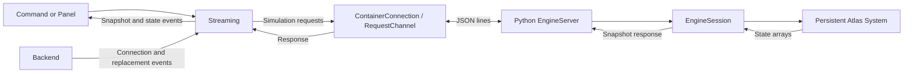

# Engine Control and Streaming

`src/atlas/streaming/` is the middleware through which the extension creates and
controls Atlas simulations and receives their results. Backend owns Docker
images, containers, and connection lifetime. Streaming owns the simulation session
on that connection. Its Python runtime replaces the temporary example bridge and
keeps an actual Atlas `System` alive across requests.

## Ownership and Data Flow



`createContributions()` creates a Backend and a Streaming instance using it.
Inject that same Streaming into consuming commands or panels. Streaming does not
call VS Code UI APIs; consumers choose how to display the received data. The central Simulation view owns Apply, Start, Pause, Step, and Reset. Left
OUTPUT exports snapshots, right SIMULATION STATUS displays statistics, and bottom
SIMULATION LOG records progress and errors. SOLVERS edits configuration only.

| File under `src/atlas/` | Responsibility |
| --- | --- |
| `streaming/streaming.ts` | Session state, request ordering, continuous execution, pause, and subscriptions |
| `streaming/streaming_types.ts` | Configuration, particle data, snapshots, and run options |
| `streaming/runtime_source.ts` | Read Python assets and assemble the container bootstrap |
| `streaming/runtime/engine_server.py` | Dispatch allowed requests and encode results/errors |
| `streaming/runtime/engine_session.py` | Create, retain, advance, read, and modify the Atlas System |
| `streaming/runtime/engine_scene.py` | Build geometry, sources, colliders, sinks, observers, and temporary OBJ resources |
| `detail/private_helpers.ts` | Shared helpers including snapshot validation |

## API

Wait for a prepared Backend connection before calling `initialize()`. Streaming
reports a missing connection rather than installing Docker images or changing the
backend mode itself.

| Method | Behavior and return value |
| --- | --- |
| `initialize(config)` | Create a System and replace the previous session after obtaining a valid initial snapshot; `Promise<SimulationSnapshot>` |
| `get_snapshot()` | Request current engine data; `Promise<SimulationSnapshot>` |
| `step(count = 1)` | Advance 1–1000 integer steps and return the result; `Promise<SimulationSnapshot>` |
| `set_particles(particles)` | Update positions, velocities, and species without changing particle count; `Promise<SimulationSnapshot>` |
| `reset()` | Recreate the System and solver from the initial configuration at step zero; `Promise<SimulationSnapshot>` |
| `close()` | Release the simulation while retaining the backend connection; `Promise<void>` |
| `start(options?)` | Start repeated step requests; `void` |
| `pause()` | Stop scheduling and wait for the in-flight step request; `Promise<void>` |
| `on_snapshot(listener)` | Subscribe to snapshots; returns an unsubscribe function |
| `on_state(listener)` | Subscribe to state/error changes; returns an unsubscribe function |
| `dispose()` | Stop scheduling, abort pending work, and release subscriptions; `void` |

Read-only getters expose `state`, `last_snapshot`, and `last_error`. The last valid
snapshot is cleared on connection replacement, disconnection, or session closure.

`start()` defaults to `{ steps_per_update: 1, interval_ms: 100 }`. Only one request
is in flight at a time. After each response, Streaming waits `interval_ms` before
requesting the next batch. This delay is independent of simulation `dt`; the
server does not push an unbounded stream of results.

`pause()` allows the current request to finish without cancelling the container
connection. Calling `start()` again continues the same System. Manual requests
are rejected while running or busy: use `await pause()` before querying,
modifying, resetting, or closing a running session.

## Case Application and Scene Construction

The normal UI path converts `CaseProject` through `to_simulation_config()` and
passes the result to `initialize()`. Apply records the project revision only after
a successful response. Editing the case makes that revision stale; Start, Step,
and Reset require the current case to be applied. Replacing an existing session
requires confirmation. Reset replays the last applied initial configuration,
including its initial particles, rather than restoring the default sidebar case.

`SimulationConfig` includes material parameters, collision model (`vhs` or `vss`),
solver controls, particle buffer capacity, domain, initial particles, and an
optional scene. Particle positions and velocities are three-number tuples;
species values index the material array. The runtime validates finite values,
float32 representability, positive time step/statistical weight/cell size,
domain bounds, material references, and buffer capacity. Sources require an
explicit particle buffer capacity.

EngineSession constructs Molecule materials, MaterialDictionary, Fluid, Universe,
the selected DSMC kernel/solver, and a persistent Atlas System. EngineScene
constructs the configured scene:

| Configuration | Runtime behavior |
| --- | --- |
| Geometry | Sphere, box, open cylinder, plane, circle, square, triangle, polygonal prism, and triangle mesh |
| Transform | Translation, Euler XYZ orientation, linear velocity, and angular velocity |
| Sources | Volume/surface sampling with a Maxwell-Boltzmann generator, material, temperature, and bulk velocity |
| Boundaries | Isothermal colliders with accommodation, restitution, and diffuse sampling settings |
| Sinks | Volume, surface, tracing, and outside-box removal |
| Domain | Automatic removal outside its six faces, independent of user-defined sinks |
| Observer | Optional interval-based output to a directory inside the container |

Native geometry validity and source sampling are checked before a replacement
scene becomes active. Infinite planes cannot be sources, and two-dimensional
circle/square/triangle geometry cannot be a volume source. Empty source sampling
is rejected. Domain removal preserves positions exactly on a domain boundary;
there is no sidebar option to disable outside-domain deletion.

Triangle-mesh asset text travels with the scene configuration and becomes a
temporary OBJ file inside the container. No host absolute mesh path or volume
mount is required. Closing the scene removes its temporary mesh resources.
Observer output is separate, under the container's temporary `atlas-results`
directory and configured relative output path. It is not automatically copied to
the host and is lost when the container is removed.

For programmatic control, use the shared Streaming instance:

```ts
const revision = project.revision;
const initial = await streaming.initialize(await project.to_simulation_config());
project.mark_applied(revision);
const next = await streaming.step(10);
streaming.start({ steps_per_update: 1, interval_ms: 100 });
await streaming.pause();
await streaming.reset();
await streaming.close();
```

This sequence illustrates the service API; UI consumers must also handle current
state, errors, confirmation, and stale project revisions as SimulationView does.

## Snapshots and Protocol

A snapshot contains `step`, `dt`, `time`, `particle_count`, `cell_count`, and the
complete `positions`, `velocities`, and `species` arrays. Time is calculated as
`step * dt`. Arrays are copies read from the actual System; modifying a received
TypeScript object does not modify the engine. Use `set_particles()` to write data.
Full snapshots are JSON-encoded, not binary or incremental updates.

Requests have shape `{ id, method, params? }`; responses are `{ id, result }` or
`{ id, error }`.

| Wire method | Parameters | Successful result |
| --- | --- | --- |
| `info` | None | Backend/native probe information |
| `initialize` | SimulationConfig | Snapshot |
| `snapshot` | None | Snapshot |
| `step` | `{ count }` | Snapshot |
| `set_particles` | ParticleData | Snapshot |
| `reset` | None | Snapshot |
| `close` | None | `null` |

The server does not accept arbitrary scripts, Python code, or executable paths.

## State and Failure Handling

States are `empty`, `ready`, `running`, `paused`, `disconnected`, `error`, and
`disposed`. Manual failures reject their promises. Continuous-run failures stop
future scheduling and are exposed through `last_error` and state events.

Invalid initialization preserves the existing System. Errors during native
stepping or between particle-array writes do not roll back changes already made.
Use reset or reinitialization to recover the simulation state.

Backend replacement or disconnection invalidates the session. Late responses from
the old connection are discarded; initialize again on the new connection.
Unexpected termination preserves its original error in `last_error`. Intentional
replacement or disposal aborts pending operations with `AbortError`.

Transport cancellation and the current 60-second request timeout close the
container connection. Use `pause()` rather than `dispose()` to stop execution
while preserving the current simulation.

## Runtime Assets and Validation

esbuild copies `engine_scene.py`, `engine_session.py`, and `engine_server.py`
to `dist/runtime/`.
Opening a connection reads those assets and assembles a temporary Python package
inside the container. Atlas and NumPy come from the image; the host does not need
an Atlas Python installation. Native output is redirected away from protocol
stdout.

`test/streaming.test.ts` uses substitute connections to cover session control,
request ordering, pause/resume, stale responses, and failure handling. Docker
transport tests use a temporary executable. Neither proves that the real Python
runtime or simulation executes successfully.

A validation report must identify the commands actually executed for that change.
Source inspection, substitute tests, native engine checks, and visual interaction
checks establish different things. See
[Development workflow](development.md#checks-and-tests).

## Presentation and Exports

Streaming retains full particle snapshots. The central browser preview receives
at most 20,000 sampled particles per frame, together with the true particle count.
Right-side statistics and left-side CSV exports use the full snapshot. The
preview renders configured geometry at its initial pose: live unit transforms
are not part of the snapshot protocol.

The right sidebar shows step/time, particle/cell counts, speed statistics, species
counts, and a bounded history of recent snapshots. SIMULATION LOG records state
changes and throttled progress; it is separate from Docker/native diagnostics.

OUTPUT offers particle CSV (positions, velocities, species indices, step, time)
and statistics CSV (counts and speed statistics per populated species). Each
export captures one snapshot before opening the save dialog so ongoing execution
does not mix steps. These exports are independent of runtime observer files.
