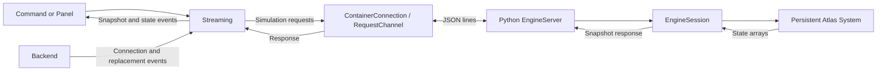

# Engine Control and Streaming

`src/atlas/streaming/` is the middleware through which the extension creates and
controls Atlas simulations and receives their results. Backend owns Docker
images, containers, and connection lifetime. Streaming owns the simulation session
on that connection. Its Python runtime replaces the temporary example bridge and
keeps an actual Atlas `System` alive across requests.

## Ownership and Data Flow



`createContributions()` creates a Backend and a Streaming instance using it.
Inject that same Streaming into consuming commands or panels. Streaming does not
call VS Code UI APIs; consumers choose how to display the received data. Overview
remains empty and no simulation control commands or screens are registered yet.

| File under `src/atlas/` | Responsibility |
| --- | --- |
| `streaming/streaming.ts` | Session state, request ordering, continuous execution, pause, and subscriptions |
| `streaming/streaming_types.ts` | Configuration, particle data, snapshots, and run options |
| `streaming/runtime_source.ts` | Read Python assets and assemble the container bootstrap |
| `streaming/runtime/engine_server.py` | Dispatch allowed requests and encode results/errors |
| `streaming/runtime/engine_session.py` | Create, retain, advance, read, and modify the Atlas System |
| `detail/private_helpers.ts` | Shared helpers including snapshot validation |

## API

Wait for a prepared Backend connection before calling `initialize()`. Streaming
reports a missing connection rather than installing Docker images or changing the
backend mode itself.

| Method | Behavior and return value |
| --- | --- |
| `initialize(config)` | Create a System and replace the previous session after obtaining a valid initial snapshot; `Promise<SimulationSnapshot>` |
| `get_snapshot()` | Request current engine data; `Promise<SimulationSnapshot>` |
| `step(count = 1)` | Advance 1–1000 integer steps and return the result; `Promise<SimulationSnapshot>` |
| `set_particles(particles)` | Update positions, velocities, and species without changing particle count; `Promise<SimulationSnapshot>` |
| `reset()` | Recreate the System and solver from the initial configuration at step zero; `Promise<SimulationSnapshot>` |
| `close()` | Release the simulation while retaining the backend connection; `Promise<void>` |
| `start(options?)` | Start repeated step requests; `void` |
| `pause()` | Stop scheduling and wait for the in-flight step request; `Promise<void>` |
| `on_snapshot(listener)` | Subscribe to snapshots; returns an unsubscribe function |
| `on_state(listener)` | Subscribe to state/error changes; returns an unsubscribe function |
| `dispose()` | Stop scheduling, abort pending work, and release subscriptions; `void` |

Read-only getters expose `state`, `last_snapshot`, and `last_error`. The last valid
snapshot is cleared on connection replacement, disconnection, or session closure.

`start()` defaults to `{ steps_per_update: 1, interval_ms: 100 }`. Only one request
is in flight at a time. After each response, Streaming waits `interval_ms` before
requesting the next batch. This delay is independent of simulation `dt`; the
server does not push an unbounded stream of results.

`pause()` allows the current request to finish without cancelling the container
connection. Calling `start()` again continues the same System. Manual requests
are rejected while running or busy: use `await pause()` before querying,
modifying, resetting, or closing a running session.

## Initialization Example

This is a consumer-side example, not a fixed simulation embedded in the runtime.
`streaming` denotes the shared instance injected into a command or panel.

```ts
import type { SimulationConfig } from '../streaming/streaming_types';

const config: SimulationConfig = {
    dt: 1e-4,
    statistical_weight: 1e18,
    materials: [{
        mass: 4.65e-26,
        translational_energy: 0,
        rotational_energy: 0,
        vibrational_energy: 0,
        reference_diameter: 4.17e-10,
        reference_temperature: 273,
        viscosity_index: 0.74,
        scattering_parameter: 1
    }],
    domain: {
        lower_corner: [0, 0, 0],
        upper_corner: [1, 1, 1],
        cell_size: 1
    },
    particles: {
        positions: [[0.4, 0.5, 0.5], [0.6, 0.5, 0.5]],
        velocities: [[100, 0, 0], [-100, 0, 0]],
        species: [0, 0]
    }
};

const initial = await streaming.initialize(config);
const next = await streaming.step(10);
const unsubscribe = streaming.on_snapshot(snapshot => {
    console.log(snapshot.step, snapshot.particle_count);
});
streaming.start({ steps_per_update: 1, interval_ms: 100 });
```

A later pause/reset/close action can use:

```ts
await streaming.pause();
const paused = await streaming.get_snapshot();
await streaming.reset();
await streaming.close();
unsubscribe();
```

Positions and velocities are arrays of three-number tuples. Species is an integer
array of the same length, with each value indexing `materials`. The runtime
validates finite numeric inputs and float32 representability, positive `dt`,
statistical weight and cell size, domain bounds, and species references.
Reinitialize with a new configuration to change the particle count.

The runtime currently constructs Molecule materials, an array-backed Fluid,
Universe, and DsmcSolver. It does not expose source, collider, or sink configuration.
A Universe extent alone does not define reflecting or periodic boundaries. Choose
physical units and parameters consistently with the engine model.

## Snapshots and Protocol

A snapshot contains `step`, `dt`, `time`, `particle_count`, `cell_count`, and the
complete `positions`, `velocities`, and `species` arrays. Time is calculated as
`step * dt`. Arrays are copies read from the actual System; modifying a received
TypeScript object does not modify the engine. Use `set_particles()` to write data.
Full snapshots are JSON-encoded, not binary or incremental updates.

Requests have shape `{ id, method, params? }`; responses are `{ id, result }` or
`{ id, error }`.

| Wire method | Parameters | Successful result |
| --- | --- | --- |
| `info` | None | Backend/native probe information |
| `initialize` | SimulationConfig | Snapshot |
| `snapshot` | None | Snapshot |
| `step` | `{ count }` | Snapshot |
| `set_particles` | ParticleData | Snapshot |
| `reset` | None | Snapshot |
| `close` | None | `null` |

The server does not accept arbitrary scripts, Python code, or executable paths.

## State and Failure Handling

States are `empty`, `ready`, `running`, `paused`, `disconnected`, `error`, and
`disposed`. Manual failures reject their promises. Continuous-run failures stop
future scheduling and are exposed through `last_error` and state events.

Invalid initialization preserves the existing System. Errors during native
stepping or between particle-array writes do not roll back changes already made.
Use reset or reinitialization to recover the simulation state.

Backend replacement or disconnection invalidates the session. Late responses from
the old connection are discarded; initialize again on the new connection.
Unexpected termination preserves its original error in `last_error`. Intentional
replacement or disposal aborts pending operations with `AbortError`.

Transport cancellation and the current 60-second request timeout close the
container connection. Use `pause()` rather than `dispose()` to stop execution
while preserving the current simulation.

## Runtime Assets and Validation

esbuild copies `engine_session.py` and `engine_server.py` to `dist/runtime/`.
Opening a connection reads those assets and assembles a temporary Python package
inside the container. Atlas and NumPy come from the image; the host does not need
an Atlas Python installation. Native output is redirected away from protocol
stdout.

`test/streaming.test.ts` uses substitute connections to cover session control,
request ordering, pause/resume, stale responses, and failure handling. Docker
transport tests use a temporary executable. Neither proves that the real Python
runtime or simulation executes successfully.

The current runtime replacement has not had builds, tests, Docker, or simulations
executed. See [Development workflow](development.md#checks-and-tests) for the
available validation procedures.
