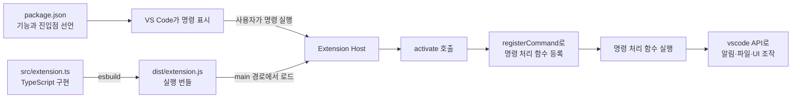

# VS Code 확장 구조 이해하기

VS Code 확장은 에디터 안에서 직접 실행되는 단일 스크립트라기보다,
`package.json`으로 기능을 선언하고 Extension Host에서 JavaScript 코드를 실행하는 프로그램이다.
이 프로젝트는 TypeScript로 작성한 코드를 esbuild로 번들링한 뒤 VS Code가 결과물을 로드한다.

## 전체 실행 흐름



현재 프로젝트에서 사용자가 `Hello World`를 실행하면 다음 순서로 동작한다.

1. VS Code가 `package.json`의 `contributes.commands`를 읽고 명령 팔레트에 `Hello World`를 표시한다.
2. 사용자가 명령을 실행하면 VS Code가 확장의 진입 파일 `dist/extension.js`를 Extension Host에 로드한다.
3. VS Code가 내보낸 `activate(context)` 함수를 호출한다.
4. `activate()`가 `atlas-engine.helloWorld` 명령의 처리 함수를 등록한다.
5. 등록된 처리 함수가 실행되어 알림을 표시한다.
6. 같은 세션에서 다시 명령을 실행하면 이미 등록된 처리 함수만 호출된다. `activate()`는 매번 다시 실행되지 않는다.

## VS Code 본체와 Extension Host

VS Code는 확장 코드를 별도의 Extension Host 프로세스에서 실행한다.
확장에 오류가 생기거나 작업이 오래 걸리더라도 에디터 UI 전체에 미치는 영향을 줄이기 위한 구조다.

```text
VS Code Workbench
├── 편집기, 명령 팔레트, 사이드바 등의 UI
└── Extension Host
    ├── atlas-engine 확장
    ├── 다른 설치된 확장
    └── vscode API
```

확장 코드는 `import * as vscode from 'vscode'`로 제공되는 API를 통해 VS Code와 통신한다.
`vscode` 모듈은 npm 패키지처럼 일반 Node.js가 실행 시 제공하는 모듈이 아니다.
따라서 `node src/extension.ts`나 `node dist/extension.js`로 직접 실행하면 정상 동작하지 않는다.
개발용 VS Code 창이나 VS Code 테스트 러너 안에서 실행해야 한다.

Extension Host의 Node.js 버전은 터미널에서 확인한 로컬 Node.js 버전과 다를 수 있다.
Node.js API를 사용할 때는 `package.json`의 `engines.vscode`가 지원하는 VS Code 환경을 기준으로 판단한다.

## 현재 프로젝트의 파일 구조

```text
atlas-engine-extension/
├── package.json                 확장 manifest와 npm 스크립트
├── package-lock.json            의존성 버전 고정
├── src/
│   ├── extension.ts             확장 진입점과 명령 등록
│   └── test/
│       └── extension.test.ts    VS Code 통합 테스트
├── dist/
│   ├── extension.js             VS Code가 실제로 실행하는 번들
│   └── extension.js.map         TypeScript 디버깅용 소스맵
├── esbuild.js                   번들 생성 설정
├── tsconfig.json                TypeScript 검사 설정
├── eslint.config.mjs            코드 검사 설정
├── .vscode-test.mjs             확장 테스트 러너 설정
├── .vscode/
│   ├── launch.json              VS Code에서 F5 실행할 때의 설정
│   └── tasks.json               빌드 작업 설정
├── scripts/
│   └── dev.sh                   개발 창과 watch 실행
└── docs/
    ├── development.md           CLion 개발·실행·디버깅 방법
    └── vscode-extension-architecture.md
                                 확장 구조 설명
```

`src`는 사람이 수정하는 원본이고 `dist`는 빌드 결과다.
현재 `package.json`의 `main`은 `./dist/extension.js`이므로 VS Code는 `src/extension.ts`를 직접 읽지 않는다.
코드를 저장했지만 빌드하지 않았거나 개발 창을 Reload하지 않으면 이전 코드가 계속 실행될 수 있다.

## `package.json`: 확장의 manifest

`package.json`은 npm 설정인 동시에 VS Code 확장의 manifest다.
VS Code는 이 파일을 먼저 읽어서 확장의 정체, 호환 버전, 진입점과 제공 기능을 파악한다.

현재 핵심 부분은 다음과 같다.

```json
{
  "name": "atlas-engine",
  "displayName": "atlas-engine",
  "version": "0.0.1",
  "engines": {
    "vscode": "^1.138.0"
  },
  "activationEvents": [],
  "main": "./dist/extension.js",
  "contributes": {
    "commands": [
      {
        "command": "atlas-engine.helloWorld",
        "title": "Hello World"
      }
    ]
  }
}
```

| 속성 | 현재 값의 의미 |
| --- | --- |
| `name` | 확장의 식별에 사용하는 이름 |
| `displayName` | Marketplace와 확장 화면에 표시할 이름 |
| `version` | 확장 버전 |
| `engines.vscode` | 지원하는 VS Code 버전 범위 |
| `main` | Node.js Extension Host가 불러올 JavaScript 진입 파일 |
| `contributes` | VS Code UI와 시스템에 제공하는 기능의 선언 |
| `activationEvents` | 확장을 활성화하는 조건을 명시적으로 추가하는 곳 |

`contributes.commands`는 명령의 존재와 표시 이름을 선언한다.
이 선언만으로 명령의 실제 동작이 만들어지는 것은 아니다.
같은 명령 ID를 `vscode.commands.registerCommand()`로 구현해야 한다.

현대 VS Code에서는 `commands` 같은 기여점을 선언하면 해당 기능에 필요한 활성화 이벤트가 자동으로 만들어진다.
그래서 현재 `activationEvents`가 빈 배열이어도 `Hello World` 실행 시 확장이 활성화된다.
파일 형식, 언어, 워크스페이스 조건 등 별도 시점에 활성화해야 할 때는 명시적인 이벤트가 필요할 수 있다.
확장을 너무 일찍 활성화하면 시작 시간과 메모리 사용에 영향을 줄 수 있으므로 실제 기능이 필요할 때 활성화하는 편이 좋다.

대표적인 기여점은 다음과 같다.

| 기여점 | 용도 |
| --- | --- |
| `commands` | 명령 팔레트나 메뉴에서 실행할 명령 선언 |
| `menus` | 편집기 우클릭, 탐색기, 타이틀 바 등에 명령 배치 |
| `configuration` | Settings 화면에 확장 설정 추가 |
| `views` | 사이드바나 패널에 사용자 정의 View 추가 |
| `keybindings` | 키보드 단축키 제공 |
| `languages` | 언어 ID, 확장자, 주석 방식 등 선언 |
| `grammars` | TextMate 문법을 이용한 구문 강조 |

## `extension.ts`: 확장의 진입점

현재 구현을 역할별로 줄이면 다음과 같다.

```ts
import * as vscode from 'vscode';

export function activate(context: vscode.ExtensionContext) {
  const disposable = vscode.commands.registerCommand(
    'atlas-engine.helloWorld',
    () => {
      vscode.window.showInformationMessage('Hello World from atlas-engine!');
    },
  );

  context.subscriptions.push(disposable);
}

export function deactivate() {}
```

### `activate(context)`

확장이 처음 활성화될 때 한 번 호출되는 초기화 함수다.
보통 여기에서는 다음 작업을 한다.

- 명령 처리 함수 등록
- 파일 저장이나 편집기 변경 이벤트 구독
- Tree View, Webview, 언어 기능 Provider 등록
- 설정 읽기와 서비스 객체 초기화
- 확장이 종료될 때 정리할 자원 등록

`activate()`가 오래 걸리면 사용자가 처음 기능을 실행할 때 지연이 생긴다.
네트워크 요청이나 큰 파일 탐색처럼 무거운 작업은 실제로 필요해질 때 실행하는 방식이 좋다.

### `ExtensionContext`

`context`는 현재 확장의 실행 환경과 수명에 관한 정보를 제공한다.
주로 사용하는 항목은 다음과 같다.

| 항목 | 용도 |
| --- | --- |
| `subscriptions` | 종료 시 `dispose()`할 명령, 이벤트 구독 등의 목록 |
| `extensionUri` | 설치된 확장의 루트 위치 |
| `globalState` | 모든 워크스페이스에서 공유하는 작은 상태 저장 |
| `workspaceState` | 현재 워크스페이스에 한정된 작은 상태 저장 |
| `globalStorageUri` | 확장 전용 파일을 영구 저장할 위치 |
| `secrets` | 토큰과 비밀번호 같은 민감한 값을 저장하는 API |

`globalState`와 `workspaceState`는 작은 JSON 형태의 상태에 적합하다.
대용량 파일이나 데이터베이스는 `globalStorageUri` 아래에 저장하는 편이 맞다.
인증 토큰을 설정 파일이나 일반 상태 저장소에 평문으로 넣지 않고 `context.secrets`를 사용한다.

### `registerCommand()`

명령 ID와 실제 처리 함수를 연결한다.

```ts
const disposable = vscode.commands.registerCommand(
  'atlas-engine.helloWorld',
  async () => {
    await vscode.window.showInformationMessage('Hello World from atlas-engine!');
  },
);
```

첫 번째 인자는 `package.json`에 선언한 것과 동일한 명령 ID다.
두 번째 인자는 명령이 실행될 때 호출할 함수다.
파일 읽기, 사용자 입력, 외부 프로세스 실행처럼 비동기 작업이 있으면 `async` 함수로 구현한다.

`registerCommand()`의 반환값은 `Disposable`이다.
이를 `context.subscriptions`에 추가하면 확장이 비활성화될 때 VS Code가 자동으로 등록을 해제한다.

### `deactivate()`

Extension Host가 확장을 종료할 때 정리가 필요하면 사용한다.
`context.subscriptions`에 넣은 자원은 자동으로 정리되므로 현재 함수는 비어 있어도 된다.
직접 만든 서버, 자식 프로세스, 데이터베이스 연결처럼 별도로 종료해야 하는 자원이 있으면 여기에서 정리한다.
비동기 정리가 필요하면 Promise를 반환할 수 있다.

## 선언과 구현은 한 쌍이다

새 명령 하나에는 보통 다음 두 부분이 모두 필요하다.

`package.json`에 명령을 선언한다.

```json
{
  "contributes": {
    "commands": [
      {
        "command": "atlas-engine.openProject",
        "title": "Atlas: Open Project"
      }
    ]
  }
}
```

`src/extension.ts`에 같은 ID의 처리 함수를 등록한다.

```ts
const disposable = vscode.commands.registerCommand(
  'atlas-engine.openProject',
  async () => {
    const folder = await vscode.window.showOpenDialog({
      canSelectFolders: true,
      canSelectFiles: false,
      canSelectMany: false,
    });

    if (!folder?.[0]) {
      return;
    }

    vscode.window.showInformationMessage(`Selected: ${folder[0].fsPath}`);
  },
);

context.subscriptions.push(disposable);
```

ID가 한 글자라도 다르면 명령 팔레트에는 보이지만 실행 시 구현을 찾지 못하는 문제가 생긴다.
명령 ID는 보통 `<확장 이름>.<동작>` 형태로 만들고 한번 공개한 ID는 호환성을 위해 함부로 바꾸지 않는다.

## `vscode` API의 주요 영역

| API | 담당 영역 | 사용 예 |
| --- | --- | --- |
| `vscode.window` | 사용자에게 보이는 창과 UI | 알림, 입력창, Quick Pick, 터미널, 현재 편집기 |
| `vscode.workspace` | 워크스페이스와 파일 | 설정, 파일 시스템, 문서 열기, 파일 변경 이벤트 |
| `vscode.commands` | 명령 시스템 | 명령 등록, 내장 또는 다른 확장의 명령 호출 |
| `vscode.languages` | 언어 기능 | 진단, 자동 완성, Hover, Definition Provider |
| `vscode.tasks` | 작업 실행 | 빌드와 테스트 Task 제공·실행 |
| `vscode.debug` | 디버깅 기능 | Debug Configuration 제공, 디버그 세션 제어 |
| `vscode.env` | VS Code 실행 환경 | 클립보드, 외부 URL 열기, 앱 정보 |

VS Code가 제공하는 파일 시스템 API는 로컬 파일뿐 아니라 SSH, 컨테이너 같은 원격 워크스페이스에서도 동작할 수 있다.
확장이 원격 환경을 지원해야 한다면 Node.js의 `fs`와 로컬 경로를 무조건 사용하는 방식보다
`vscode.workspace.fs`와 `vscode.Uri`를 우선 검토한다.

## 프로젝트가 커질 때의 권장 구조

지금 규모에서는 `extension.ts` 하나로 충분하다.
명령과 UI가 늘어나면 `extension.ts`에는 조립 코드만 두고 기능별 구현을 분리하는 편이 관리하기 쉽다.

```text
src/
├── extension.ts                 전체 기능을 조립하고 등록
├── commands/
│   ├── buildProject.ts          프로젝트 빌드 명령
│   └── openProject.ts           프로젝트 선택 명령
├── services/
│   ├── atlasEngine.ts           Atlas 프로세스 실행과 통신
│   └── projectDiscovery.ts      프로젝트 검색
├── providers/
│   └── projectTreeProvider.ts   사이드바 Tree View 데이터
├── webviews/
│   └── dashboardPanel.ts        Webview 생성과 메시지 처리
├── models/
│   └── project.ts               공유 타입과 데이터 모델
└── test/
    ├── extension.test.ts        실제 VS Code가 필요한 통합 테스트
    └── projectDiscovery.test.ts VS Code 의존성이 적은 로직 테스트
```

예를 들어 명령 등록 함수를 다음처럼 분리할 수 있다.

```ts
// src/commands/registerCommands.ts
import * as vscode from 'vscode';

export function registerCommands(context: vscode.ExtensionContext): void {
  context.subscriptions.push(
    vscode.commands.registerCommand('atlas-engine.helloWorld', () => {
      vscode.window.showInformationMessage('Hello World from atlas-engine!');
    }),
  );
}
```

```ts
// src/extension.ts
import * as vscode from 'vscode';
import { registerCommands } from './commands/registerCommands';

export function activate(context: vscode.ExtensionContext): void {
  registerCommands(context);
}

export function deactivate(): void {}
```

분리 기준은 파일 크기보다 책임이다.
명령은 사용자 동작을 받아 서비스에 전달하고, 서비스는 핵심 로직과 외부 프로세스 통신을 담당하게 만든다.
이렇게 하면 VS Code API에 직접 의존하지 않는 로직을 빠른 단위 테스트로 검증하기 쉬워진다.

## 상태와 데이터가 흐르는 방식

기능이 커질수록 UI 처리와 핵심 로직을 분리하는 것이 중요하다.

```text
사용자 입력
   ↓
Command / View / Webview
   ↓
Service
   ├── workspace.fs로 파일 접근
   ├── child_process로 Atlas 엔진 실행
   └── 설정과 상태 읽기
   ↓
결과 모델
   ↓
알림 / Output Channel / Tree View / Webview 갱신
```

단순한 성공 메시지는 `showInformationMessage()`로 충분하다.
진행 로그가 많으면 `OutputChannel`, 취소 가능한 긴 작업이면 `window.withProgress()`,
구조화된 목록이면 Tree View, 복잡한 화면이면 Webview가 적합하다.
Webview는 별도의 HTML/JavaScript 환경이므로 Extension Host와 메시지로 통신하며 보안 정책과 자원 URI 처리가 추가로 필요하다.

## 빌드 구조

현재 빌드는 다음 경로로 이어진다.

```text
src/extension.ts와 import된 파일들
              ↓ TypeScript 타입 검사
          tsc --noEmit
              ↓ esbuild 번들
       dist/extension.js
       dist/extension.js.map
              ↓ package.json의 main
         Extension Host
```

`tsc --noEmit`은 타입 오류를 검사하지만 JavaScript를 만들지 않는다.
실제 실행 파일은 `esbuild.js`가 생성한다.
`vscode` 모듈은 실행 시 VS Code가 제공하므로 esbuild 설정에서 `external`로 제외되어 있다.

개발 빌드는 소스맵을 생성하고, 배포용 `npm run package`는 코드를 압축한다.
번들에 포함되는 라이브러리는 확장 크기와 시작 시간에 영향을 주므로 필요한 의존성만 사용한다.

## 테스트 구조

확장 테스트는 두 종류로 나누어 생각하면 편하다.

| 종류 | 실행 환경 | 적합한 대상 |
| --- | --- | --- |
| 단위 테스트 | 일반 Node.js | 파서, 모델 변환, 경로 계산 등 순수 로직 |
| 확장 통합 테스트 | VS Code Extension Host | 명령 등록, 활성화, Workspace API, UI 연동 |

현재 `src/test/extension.test.ts`는 테스트용 VS Code를 실행해 다음 경로를 확인한다.

```text
확장 로드 → manifest에서 명령 확인 → 명령 실행 → activate 호출 → 확장 활성 상태 확인
```

이 테스트는 실제 알림의 시각적 모양까지 확인하지 않는다.
UI 문구와 사용자 흐름은 개발용 창에서 직접 확인하고, 핵심 로직은 가능한 한 UI와 분리해 단위 테스트한다.

## 새 기능을 추가할 때 확인할 것

새 명령을 기준으로 하면 다음 순서가 안전하다.

1. `package.json`의 적절한 `contributes` 항목에 기능을 선언한다.
2. `extension.ts` 또는 `commands` 모듈에서 같은 ID로 구현을 등록한다.
3. 반환된 `Disposable`을 `context.subscriptions`에 추가한다.
4. 오래 걸리는 동작은 `async`로 만들고 오류와 취소 흐름을 처리한다.
5. 핵심 로직은 가능하면 VS Code UI 코드와 분리한다.
6. 통합 테스트나 단위 테스트를 추가한다.
7. `npm run compile`과 `npm test`를 실행한다.
8. 개발용 VS Code에서 Reload한 뒤 실제 사용자 흐름을 확인한다.

개발 창 실행과 CLion 디버거 연결 방법은 [CLion에서 VS Code 확장 개발하기](development.md)를 참고한다.

## 참고 문서

- [Extension Anatomy](https://code.visualstudio.com/api/get-started/extension-anatomy)
- [Extension Manifest](https://code.visualstudio.com/api/references/extension-manifest)
- [Activation Events](https://code.visualstudio.com/api/references/activation-events)
- [Contribution Points](https://code.visualstudio.com/api/references/contribution-points)
- [VS Code API](https://code.visualstudio.com/api/references/vscode-api)
- [Extension Host](https://code.visualstudio.com/api/advanced-topics/extension-host)
