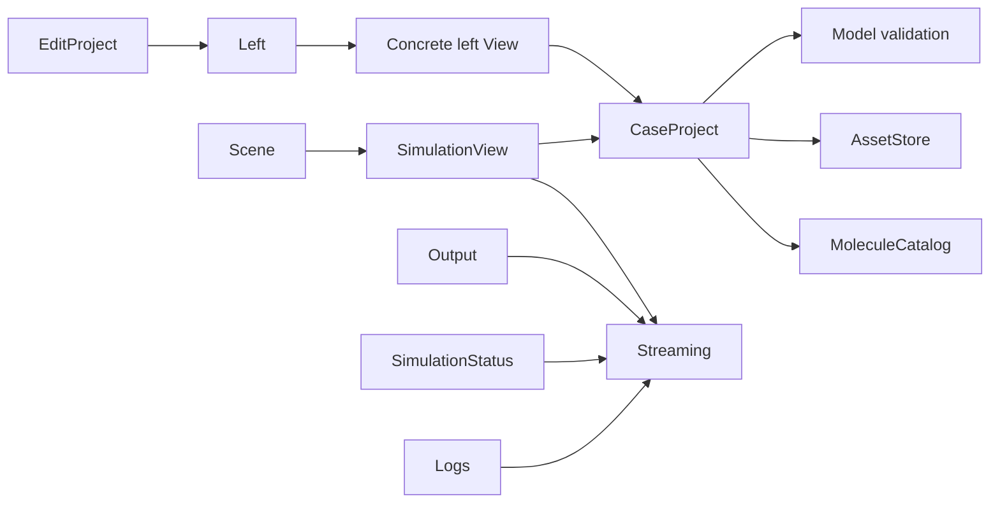

# Extension Architecture

`src/extension.ts` creates `System` and calls `system.update()`. System owns
initialization, subscriptions, refresh order, command registration, and disposal.
`createContributions()` in `src/atlas/contributions.ts` composes the shared
instances used by both the runtime and manifest extraction.

## Composition and lifecycle

```text
System
├── MoleculeCatalog
├── CaseProject → AssetStore
├── Backend → Docker connection
├── Streaming → the Backend connection
├── Layout
│   ├── Left: Domain, Assets, Materials, Geometry, Sources, Boundaries, Sinks, Solvers, Output
│   ├── Center: Scene → SimulationView → EditorView
│   ├── Right: SimulationStatus
│   └── Bottom: Logs, wrapped by PanelContainer
└── Commands: SelectBackend, CheckBackend, ShowLayout, EditProject
```

Activation passes `context.globalState`, `context.workspaceState`, and
`context.extensionUri` into System. Global state remembers the backend mode;
workspace state stores the case; the extension URI locates bundled Webview files.
VS Code loads `dist/extension.js`, not the TypeScript source.

System initializes the project, backend UI, and layout, then subscribes to project
and Streaming changes. Its first update starts backend preparation and opens the
layout. It does not automatically Apply or Start a simulation. Later updates
refresh existing views without reopening a closed Simulation tab. **Show Layout**
or **Open Simulation** can reopen it.

Project changes refresh the layout. Streaming state/snapshot events refresh
OUTPUT, the right sidebar, and the center views. Logs subscribes directly to
Streaming. File watchers for `**/assets/geometry/**` and workspace-folder changes
invalidate project asset state and the applied revision.

Disposal stops Backend, then Streaming, then CaseProject, subscriptions, command
handlers, and Layout. Late Webview reads cannot write into closed/replaced panels.

## UI ownership and dependency direction

| Owner | Responsibility |
| --- | --- |
| `views/left/*.ts` | Section field/type definitions, native tree content, and editing actions |
| `ProjectView` | Shared field rendering, reference labels, and input handling |
| `EntryView` | Shared collection add/edit/rename/remove behavior |
| `Left.execute()` | Find the owning section and forward an action |
| `EditProject` | Command-palette entry and sidebar action dispatch/error display |
| `SimulationView` | Central Apply/Start/Pause/Step/Reset operations and Webview toolbar |
| `Scene` | Scene data, asset delivery, and particle preview |
| `Output` | Observer settings and manual snapshot CSV exports |
| `SimulationStatus` | Full-snapshot statistics and recent snapshot history |
| `Logs` | State/error/progress event history |



SOLVERS contains settings only and has no Streaming dependency. The central
execution controls call Streaming directly through SimulationView, not through
a sidebar action. OUTPUT receives Streaming to export the current snapshot.
Project state and validation do not import UI field definitions. There is no
central `ProjectEditor`, `project_fields.ts`, or `geometry_fields.ts` registry.

## Case state and assets

`CaseProject` owns `ProjectState`, validated edits, workspace persistence, and
conversion to `SimulationConfig`. `change()` serializes edits, validates the
candidate, saves it, then advances the revision and notifies listeners.
`get_state()` returns a clone. `mark_applied(revision)` records successful engine
application and refreshes consumers without changing the settings revision.

State is stored under `atlas-engine.project.v1` in the VS Code workspace Memento.
There is no case file reader/writer for `atlas.jsonc`. An explicitly supplied
initial state is supported for tests; otherwise `default_state()` creates the
nitrogen case described in the [user guide](../README.md#run-your-first-simulation).
Saved nonempty cases are preserved. Legacy empty state is upgraded; an initialized
case intentionally cleared by the user stays empty. Legacy default escape-box
entries are removed only when they match the automatic Domain removal setup.
There is no separate nitrogen-preset module or load-preset command.

AssetStore copies imported OBJ files into a selected workspace's
`assets/geometry/`, avoids filename collisions, and stores a relative path plus
workspace URI. Replacing an asset updates the file after confirmation. Removing
an asset record leaves its disk file in place; validation prevents dangling case
references. Only referenced OBJ contents are sent to the engine as text. The
container does not mount the workspace. MTL/textures and external-file linking
are not implemented.

## Molecular catalog

`catalog/molecule_catalog.ts` loads the bundled PICLas VHS, SPARTA, and Weaver VSS
JSON datasets. `catalog/data/sources.json` records attribution and source links;
`metadata.json` records units and limitations. Catalog queries return copies.

MATERIALS filters catalog selection by the solver's VHS/VSS model and copies the
selected parameters into editable material records. It shows attribution, fit
ranges when provided, customizations, and model mismatch. Changing the solver
model does not silently convert existing materials. Engine application requires
matching models; VHS requires alpha = 1. Some species have no VSS preset.

These are neutral-species reference elastic-collision parameters, not chemistry,
ionization, or internal-energy-relaxation models. Refer to the bundled metadata
when changing catalog behavior or describing its physical scope.

## Simulation Webview

EditorView creates a single WebviewPanel on demand and restricts local resources
to `dist/webview`. SimulationView supplies a nonce-based script policy, HTML,
and validated execution-message handling. No CDN or external browser package
is required.

`render()` supplies the initial document. After the browser sends `ready`,
`update()` posts data messages instead of replacing HTML. Reads are coalesced;
hidden views defer delivery; closed-panel results are discarded. Scene sends
asset contents until the browser acknowledges the project revision, then reuses
the client cache. A new browser context requests a fresh delivery.

`webview/scene_renderer.ts` draws projected 3D wireframes and particles with
Canvas 2D. `detail/scene_geometry.ts` supplies primitive/OBJ geometry and Euler XYZ
transforms. Camera controls include orbit, pan, zoom, Fit, and axis presets.
Geometry is the configured initial pose; dynamic collider transforms are not
part of the engine snapshot. Infinite planes use finite dashed previews.

Display sampling caps particle arrays at 20,000; the wire preview caps OBJ input
at 500,000 vertices/250,000 triangles and polygonal prisms at 4,096 sides. Preview
errors are displayed rather than silently substituting a shape. These display
limits do not truncate statistics, CSV exports, or the engine's full snapshots.
Editing the case hides previously applied particles until the new case is applied.

Right-side history keeps up to 300 snapshots. SIMULATION LOG keeps up to 300
events and limits continuous-run progress records to about one per second.
These histories are in-memory and do not constitute saved run results.

## Source and build map

| Path | Responsibility |
| --- | --- |
| `src/extension.ts`, `src/atlas/system/` | Activation and orchestration |
| `src/atlas/contributions.ts` | Shared instance composition |
| `src/atlas/project/` | Saved case model and asset storage |
| `src/atlas/catalog/` | Molecular presets and provenance |
| `src/atlas/views/{left,right,bottom,center}/` | Region-owned UI behavior |
| `src/atlas/views/center/webview/` | Browser entry, renderer, message client, CSS |
| `src/atlas/commands/` | Registered palette/sidebar commands |
| `src/atlas/backend/` | Docker lifecycle contracts and controller |
| `src/atlas/streaming/` | Engine session middleware and wire types |
| `src/atlas/streaming/runtime/` | Python EngineServer, EngineSession, EngineScene |
| `src/atlas/detail/` | Internal implementations shared across areas |
| `config/`, `scripts/` | JSONC metadata, manifest extraction, development launcher |
| `test/` | Test sources and injected substitutes |

Build outputs are `dist/extension.js`, `dist/webview/scene.js`,
`dist/webview/simulation.css`, and three Python files under `dist/runtime/`.
Development builds include source maps. The Node and browser bundles are separate;
only the Extension Host imports live `vscode`. See [manifest generation](manifest.md)
and [development workflow](development.md) before changing these entry points.
